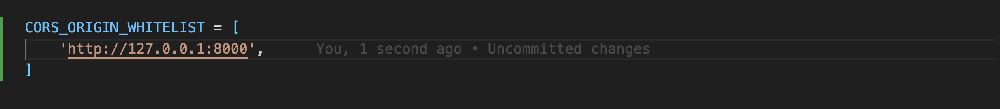

# Instructions:

- Aim to complete as much as you can in 1 hour.
- Use any online resources you need to solve the problems.
- Feel free to use any integrated development environment (IDE) or code editor of your choice.

## Part 1: Django REST Framework (20 minutes)

- Create a Django model for a simple todo list item with the specified fields.
- Implement a Django REST Framework serializer for the todo list item model.
- Create a Django REST Framework API view to handle CRUD operations for the todo list item model.

### Bonus (optional)

- Implement a GraphQL API using Graphene Django for the todo list item model.

## Part 2: React (30 minutes)

- Set up a new React project using Create React App.
- Create a React component to display a list of todo list items fetched from the Django REST Framework API.
- Add functionality to allow updating the completion status of a todo list item directly from the React component.

### Bonus (Optional):

- Integrate Apollo Client in your React project to fetch and manage data from the GraphQL API implemented in Django.

## Additional Notes:

- Remember to handle errors gracefully and provide meaningful feedback where applicable.
- Focus on functionality rather than complex styling.
- Use appropriate naming conventions and follow best practices in both Django and React development.

## Submission Details:

- Please create a public GitHub repository and commit your solution.
- Share the repository link with us by replying to this email within 3 days.

# User Stories

- As a user, I want to be able to create a new to-do item so that I can keep track of tasks I need to complete.
- As a user, I want to be able to mark a to-do item as complete so that I can track my progress and see what tasks I have finished.
- As a user, I want to be able to edit or update a to-do item so that I can make changes if necessary.
- As a user, I want to be able to view all of my to-do items in a list format so that I can see an overview of what tasks I need to complete.

# Getting Started

## BACKEND

### Prerequisites

For the application to succesfully run, you need to install the following packages:

- python3
- Node.js
- npm (Node Package Manager)

### Installation

#### Step 1) Create a Python Virtual Environment and Activate the Environment

The code blocks below need to be run firstly:

```
python3 -m venv my_venv

source my_venv/bin/activate
```

#### Step 2) Afterward Django needs to be installed.

```
pip install django
```

#### Step 3) Create project

```
django-admin startproject  todoapp .
```

#### Step 4) Make migration to create Database

```
python3 manage.py makemigrations
python3 manage.py migrate
```

#### Step 5) Create app module

```
django-admin startapp app
```

#### Step 6) Add app to Installed Apps in setting.py.


#### Step7) Install Django rest_framework.

```
pip install djangorestframework
```

- Django rest frameworks needs to be added to Installed apps in setting.py.
  

#### Step 8) Install corsheaders CORS (Cross-Origin Resource Sharing) to make requests from the domain.

```
pip install django-cors-headers
```

- Cors headers needs to be added to Installed apps in setting.py.
- Add 'corsheaders.middleware.CorsMiddleware' to the MIDDLEWARE list in settings.py file. It's important to place it before the CommonMiddleware:
  

- Configure CORS settings in settings.py file to allow request from the server.
  

#### Creating Model with title, completed status and created time fields

- After installation of all packages and tools the model of Todo object should be created.

#### Create serializers

- Serializers convert Todo model instances into JSON representations.

#### Create API views CRUD REQUESTS. - GET, POST,PATCH,DELETE

- Now we need to handle HTTP requests.
  - In app/views.py we should handle GET, POST, PATCH, DELETE requests to make api works.

#### Create urls in app.

- Create URL patterns for routing HTTP requests to the appropriate view functions.
- Update the main urls in todoapp with the path which has been created in app.py.

#### Make migration and create superuser to see application on admin browser.

```
python3 manage.py makemigrations
python3 manage.py migrate

python3 manage.py createsuperuser
```

- After creating superuser and update the admin.py file in the app directory we should be able to create data from the admin path.
  

- And with "todos" path (http://127.0.0.1:8000/todos) we should be able to see all our todos with id, title, completed status and created time fields on json format.
  

- With path todos/id we should be able to update and delete spesific todos.

* Backend completed

## FRONTEND

### Installation

#### Step 1) Create a React environment by Vite

- The command below need to be run firstly:

```
npm create vite@latest
```

- I named project name: frontend, select framework: React, Select a variant Javascript

- Then run commands below:

```
  cd frontend
  npm install
  npm run dev
```

- Update cors.
  In the todoapp/settings.py directory we need to update CORS_ALLOWED_ORIGINS to allow frond end connect with api.
  

- Install axios.
  Axios is a popular library used for making HTTP requests from the browser.

```
npm install axios
```

### Develop Frontend

#### Step 1) Create .env file.

In the frontend directory create .env file and in .env file define VITE_API_URL and assign to django api.
(VITE_API_URL =http://127.0.0.1:8000/todos)

#### Step 2) Print data to the console.

- Now we should be able to print data on the console using useEffect hook and axios.

#### Step3) After reading data on the console we should code our component TodoList and Search and then should complete the functionality of codes CRUD on the front end part.

#### Step4) After testing all code working in frontend and backend if there is no error we can start writing our CSS.

#### Step5) Client side completed, integrated with backend.
